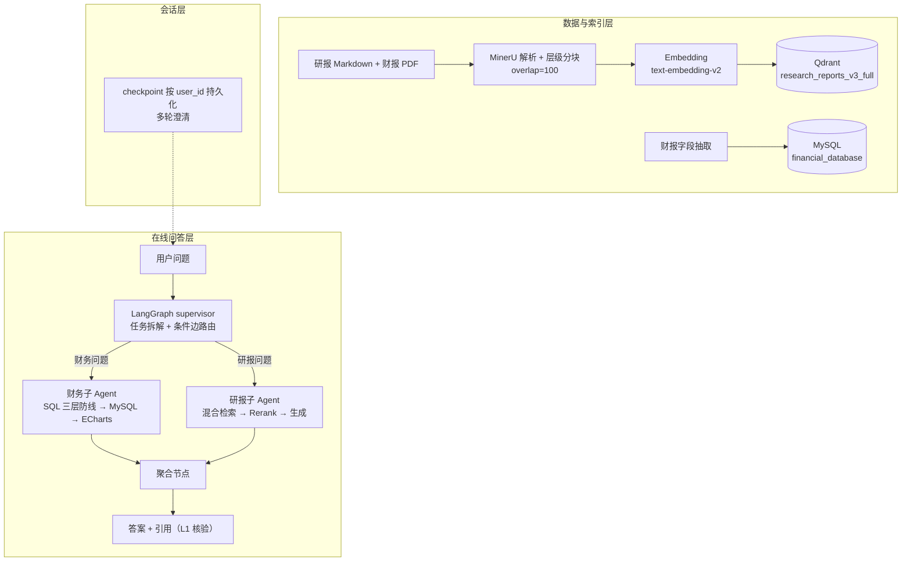

# 上市公司“智能问数”助手系统

面向上市公司研报与财报的端到端智能问答系统：用户用自然语言即可查询财务数据、研报观点，答案带引用可溯源。采用 **LangGraph 多 Agent 编排 + SQL 财务链路 + RAG 研报链路**，配套 FastAPI / React 前端与完整评估闭环。

[](https://github.com/autumnieave/smart-financial-qa/actions/workflows/ci.yml) []() [](LICENSE)

## 核心指标

- **SQL 编译通过率：96.9% → 100%**（80 题全量回归：Agent 口径 224/224，原生 SQL 链路 102/102）
- **引用文件可溯源 100%（1080/1080）**、**答案数字可溯源 100%**（归一化口径），人工回查真实幻觉 **0 例**
- **117 个离线单测全部通过**（零外部依赖，CI 自动执行）
- 数字级引用命中率 **70.2% → 74.9%**（混合检索：向量 + BM25 + RRF）

## 功能亮点

- **LangGraph supervisor-workers 多 Agent 编排**：supervisor 拆解任务，财务（SQL）/ 研报（RAG）子 Agent 并行取数，单任务直出、多任务聚合；条件边路由 + checkpoint 按 `user_id` 持久化会话，支持多轮澄清补齐缺失字段
- **SQL 生成质量闭环**：自然语言 → Schema + 字段白名单 → 静态校验 → MySQL 试运行（15s 超时）→ 执行 + 自动分析与 ECharts 图表，失败自动带错误重试
- **混合检索**：Qdrant 向量 + BM25 关键词 + RRF 融合，经 `qwen3-rerank` 精排后生成
- **L1 引用核验器**：自动核验答案数字与引用文件的对应关系，端到端可溯源
- **记忆持久化**：SQLite 默认 / Redis 可选，按 `user_id` 存取，服务重启后上下文可恢复
- **全栈可部署**：FastAPI（REST + SSE 流式）+ React 19 + Qdrant + Docker Compose

## 架构图



## 快速开始

### 1. 环境准备

```bash
python -m venv .venv && source .venv/bin/activate   # Windows: .venv\Scripts\activate
pip install -r requirements.txt
# 可复现构建（版本锁定）：pip install -r requirements.lock.txt
```

### 2. 配置环境变量

复制 `.env.example` 为 `.env` 并填写：

```bash
DASHSCOPE_API_KEY=sk-xxx        # 阿里云百炼 DashScope（必填）
MYSQL_HOST=127.0.0.1            # MySQL 财务库（原生财务查询链路，非 Docker 模式需自备）
```

### 3. 启动 Qdrant 并构建索引

```bash
docker compose up -d qdrant     # 或本地 Qdrant（localhost:6333）
python rag_全流程构建.py --build
```

### 4. 启动服务

```bash
# 交互式问答
python rag_全流程构建.py

# Web 后端（端口 8000）
uvicorn app.api:app --reload --port 8000

# 前端（qa-frontend 目录，端口 5173）
cd qa-frontend && npm install && npm run dev

# 或 Docker Compose 一键启动（Qdrant + MySQL + 后端 + Nginx 前端，MySQL 首次启动自动建表，访问 http://localhost:8080）
docker compose up -d --build
```

{anchor}

### 数据说明

- **研报与财务数据不随仓库分发**（竞赛数据）：研报语料按 `docs/DEPLOYMENT.md` 放置后运行 `python rag_全流程构建.py --build` 构建索引；财务数据由公开财报经 `tools/data_scripts/pdf处理+校验入库.py` 抽取入库（表结构见 `database/schema.sql`，仅建表、不含数据）。
- **安全提示**：MySQL 默认密码（`MYSQL_ROOT_PASSWORD` / `MYSQL_PASSWORD` = `123456`）仅用于本地开发，生产/公网部署务必通过 `.env` 修改。

## 交互命令

| 命令 | 说明 |
| :--- | :--- |
| `agent on/off` | 开关 Agent 多步推理（默认 LangGraph multi-agent） |
| `hybrid on/off` | 切换混合检索（向量 + BM25） |
| `multi-turn on/off` | 多轮澄清对话 |
| `status` | 查看各模式开关状态 |
| `rebuild` | 强制重建索引 |
| `addstock` / `addindustry` | 增量插入个股 / 行业研报 |
| `new` | 开启新话题（重置会话状态） |

## 测试与评估

```bash
python -m pytest tests/ -q        # 117 个离线单测（零外部依赖）
python -m eval sql --suite full   # SQL 全量回归
python -m eval citation           # L1 引用核验
python -m eval report             # 聚合评估报告
```

- CI：`.github/workflows/ci.yml` 在 `master` push / PR 时自动执行全部单测
- 评估口径与逐题明细见 `docs/评估报告/评估报告.md`、`docs/评估报告/SQL编译修复前后对比报告.md`、`docs/问题记录/badcase_台账.md`

## 技术栈

| 类别 | 选型 |
| :--- | :--- |
| 编程语言 | Python 3.11 |
| 大模型平台 | 阿里云百炼 DashScope（`qwen3.5-plus` / `text-embedding-v2` / `qwen3-rerank`） |
| Agent 编排 | LangGraph（supervisor-workers）、Function Calling |
| RAG 组件 | LangChain（LCEL 实验）、Qdrant、BM25（纯 Python）+ RRF |
| Web 后端 | FastAPI + Uvicorn（REST + SSE 流式） |
| 前端 | React 19 + Vite + Tailwind CSS（`qa-frontend/`） |
| 部署 | Docker Compose（Qdrant + 后端 + Nginx 前端） |
| 数据/校验 | MinerU、pandas、pymysql、sqlparse |

## 项目结构

```
app/            FastAPI 入口（api.py / schemas.py）
core/           链路接口（IRetriever / IReranker / IGenerator）
eval/           评估闭环（golden / SQL / citation / report）
pipelines/      RAGPipeline 全流程编排
agents/         LangGraph 多 Agent + 自研 AgentPlanner（对照）
prompts/        唯一 Prompt 目录
tools/          SQL 校验器 / 原生财务查询 / 数据处理脚本
tests/          117 个离线单测
qa-frontend/    React 19 前端
```

## 相关文档

| 文档 | 内容 |
| --- | --- |
| `docs/ARCHITECTURE.md` | 目标框架 vs 现状差距清单 |
| `docs/DEPLOYMENT.md` | 部署说明（本地 / 全栈 / 常见问题） |
| `docs/评估报告/评估报告.md` | 聚合评估报告（golden / SQL / 引用核验） |
| `docs/评估报告/LangGraph对照.md` | LangGraph 对照版 Agent 验证 |
| `docs/评估报告/MultiAgent对照.md` | supervisor-workers 多 Agent 协作 |
| `docs/评估报告/SQL编译修复前后对比报告.md` | SQL 质量修复前后对比与口径 |
| `docs/评估报告/RAG引用核验报告.md` | L1 引用核验明细 |
| `docs/评估报告/overlap对比实验.md` | 分块参数 overlap 对比（100 最优） |
| `docs/评估报告/检索对比实验.md` | 检索层对比：纯向量 vs 混合检索（引用命中） |
| `docs/问题记录/badcase_台账.md` | SQL badcase 台账与修复闭环 |
| `docs/问题记录/9题端到端人工抽检记录.md` | 端到端人工抽检记录 |

## License

MIT License，见 [LICENSE](LICENSE)。