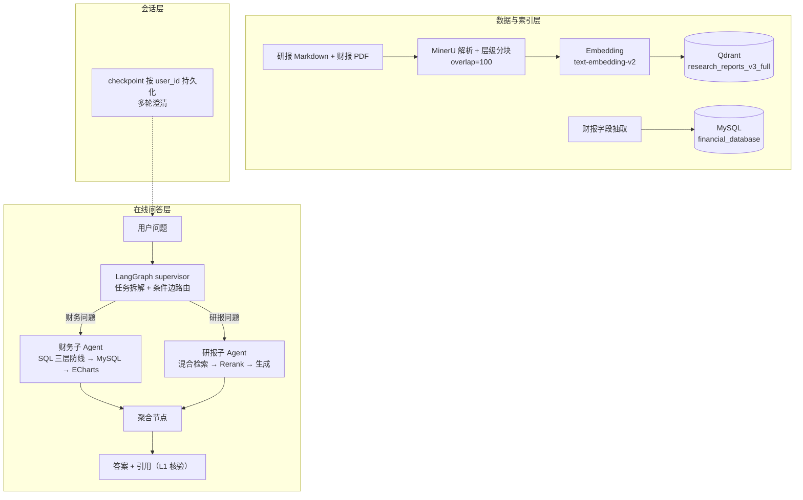

# 上市公司“智能问数”助手系统

面向上市公司研报与财报的端到端智能问答系统：用户用自然语言即可查询财务数据、研报观点，答案带引用可溯源。采用 **LangGraph 多 Agent 编排 + SQL 财务链路 + RAG 研报链路**，配套 FastAPI / React 前端与完整评估闭环。

**数据规模**：473 篇上市公司研报（MinerU 解析，OCR + 表格 + 公式）+ 1252 份深圳证券交易所 / 上海证券交易所财报 PDF，抽取后入 MySQL。

项目演示：多 Agent 编排（LangGraph supervisor-workers）、Text-to-SQL 质量闭环、混合检索与精排、五层评测体系、全栈部署。

[](https://github.com/autumnieave/smart-financial-qa/actions/workflows/ci.yml) []() [](LICENSE)

## 核心指标

- **SQL 编译通过率 100%**（80 题全量回归，多意图拆分后共 103 条 SQL，103/103 全部通过；提示词 v10，有 SQL 需求的题 69/69）
- **引用文件可溯源 100%（1080/1080）**、**答案数字可溯源 99.9%（4068/4071，归一化口径；3 项未溯源为非数据 token）**，人工回查真实幻觉 **0 例**
- **540 个离线单测全部通过**（540 用例 / 40 个测试文件，零外部依赖，CI 自动执行）
- 数字级引用命中率 **70.2% → 74.9%**（混合检索：向量 + BM25 + RRF）

## 评测体系

评测按**载体**分五层（各层对应不同失败模式），各层独立产出、**不合成单一分数**。🟢 = 已发布指标在定义口径下达标；🟡 = 有内部证据但未达发布门槛。

| 层 | 样本 / 分母 | 状态 | 已发布 / 未发布 |
| :--- | :--- | :-: | :--- |
| **L1 引用核验** | 108 子问题；分母 = 引用条数 / 数字 token | 🟢 | 引用文件可溯源 **100%（1080/1080）**；引用文本数字命中 **99.7%（9222/9248）**；端到端答案数字可溯源 **99.9%（4068/4071；未溯源 3 项为非数据 token）**；人工回查真实幻觉 **0 例** |
| **L2 SQL 编译** | 80 题 / 103 条语句；分母 = 本轮实际执行语句数 | 🟢 | **语句级编译通过率 103/103（100%）**；有 SQL 需求的题 **69/69** |
| **L3 答案质量** | LLM-as-judge 4 判据 + 同题一致性（10 × 5）+ 人工抽检 | 🟡 | **未发布**：judge 与**规则信号**一致率 **0.857（n=14；非发布口径）**；发布门槛是 judge 与**人工回查**对齐 ≥0.90，尚未做 |
| **L4 对抗挑战集** | 18 条 / 5 类（挑战集、非统计抽样） | 🟢 | 人工复核 **18/18 通过**；auto 覆盖率 **15/18**；**auto ↔ 人工一致率 100%（已判 15/15）** |
| **L5 检索排序质量** | **Hit Rate@K / Precision@K / MRR（K=10）**；30 题分层抽样 · 300 片段人工四态标注 | 🟡 | **未发布**：30 题人工标注已归档；未达发布门槛（**单人标注 + 离线召回层 + 线上口径未产出**） |

**做法摘要**：评测集按失败模式分层设计（108 子问题 / 80 题 / 18 条对抗 / 30 题分层抽样）；判据前置写死边界；确定性层全量自动跑、概率性层卡人工 ground truth；`python -m eval` 统一入口 + golden 快照版本化（sha256），结论回流 `docs/问题记录/badcase_台账.md`。

**边界**：L1 / L2 的 100% 分别只保证**引用可溯源**、**SQL 可编译执行**，**不等于答案正确**；L4 的 auto 通过只代表**未触发已知危险信号**；L5 的 HR@K / P@K / MRR 是**离线召回层**指标，**不等于线上效果**。评测做法与各层报告详见 `docs/评估报告/`。

## 功能亮点

- **LangGraph supervisor-workers 多 Agent 编排**：supervisor 拆解任务，财务（SQL）/ 研报（RAG）子 Agent 并行取数，单任务直出、多任务聚合；条件边路由 + checkpoint 按 `user_id` 持久化会话；自研手写 RAG 与多轮澄清链路保留，供 CLI 本地回归使用
- **SQL 生成质量闭环**：自然语言 → Schema + 字段白名单 → 静态校验 → MySQL 试运行（15s 超时）→ 执行 + 自动分析与 ECharts 图表，失败自动带错误重试
- **混合检索**：Qdrant 向量 + BM25 关键词 + RRF 融合，经 `qwen3-rerank` 精排后生成
- **五层评测体系**：引用核验（自研引用核验器，答案数字与引用文件自动对应）/ SQL 编译 / 答案质量 / 对抗挑战集 / 检索排序质量，各层分母不同、各覆盖一类失败模式，**不合成单一分数**（详见「评测体系」）
- **记忆持久化**：SQLite 默认 / Redis 可选，按 `user_id` 存取，服务重启后上下文可恢复
- **全栈可部署**：FastAPI（REST + SSE 流式）+ React 19 + Qdrant + Docker Compose

## 架构图


```mermaid
flowchart TD
    subgraph DATA["数据与索引层"]
        A["研报 Markdown + 财报 PDF"] --> B["MinerU 解析 + 层级分块\noverlap=100"]
        B --> C["Embedding\ntext-embedding-v2"]
        C --> D[("Qdrant\nresearch_reports_v3_full")]
        E["财报字段抽取"] --> F[("MySQL\nfinancial_database")]
    end

    subgraph ONLINE["在线问答层"]
        Q["用户问题"] --> S["LangGraph supervisor\n任务拆解 + 条件边路由"]
        S -->|"财务问题"| T1["财务子 Agent\nSQL 三层防线 → MySQL → ECharts"]
        S -->|"研报问题"| T2["研报子 Agent\n混合检索 → Rerank → 生成"]
        T1 --> AGG["聚合节点"]
        T2 --> AGG
        AGG --> R["答案 + 引用（L1 核验）"]
    end

    subgraph MEM["会话层"]
        M["checkpoint 按 user_id 持久化\n多轮澄清"] -.-> Q
    end
```

## 数据与评估资产说明

- **原始数据不随仓库分发**（原始数据，按版权不公开）：研报语料按 `docs/DEPLOYMENT.md` 放置后运行 `python cli.py --build` 构建索引；财务数据由公开财报经 `src/tools/data_scripts/pdf处理+校验入库.py` 抽取入库（表结构见 `database/schema.sql`，仅建表、不含数据）。
- **评估资产为本地 gitignored 资产，不入库**：golden 快照（`database/golden/`，含 80 题 / 108 子问题评估基准**及 v2 挑战集 18 条**（`challenge_sources/`、`v2_2026-09-10.json`））、字段抽取记录（`database/extracted_missing_fields.csv`）及各回归明细 JSON 仅保存在本地，用于复现文档中的评估口径。
- **可复现范围**：源码、离线单测（零外部依赖）、CI 与评估框架完整入库，clone 后即可运行；完整数据与评估基准需按文档自备。
- **安全提示**：MySQL 默认密码（`MYSQL_ROOT_PASSWORD` / `MYSQL_PASSWORD` = `123456`）仅用于本地开发，生产/公网部署务必通过 `.env` 修改。

## 快速开始

### 最短验证（零依赖）

```bash
# clone 后零依赖验证，不需要 API Key / 数据库 / Qdrant
pip install -r requirements.txt
python -m pytest tests/ -q    # 540 个离线单测
```

### 完整服务

#### 1. 环境准备

```bash
python -m venv .venv && source .venv/bin/activate   # Windows: .venv\Scripts\activate
pip install -r requirements.txt
# 可复现构建（版本锁定）：pip install -r requirements.lock.txt
```

#### 2. 配置环境变量

复制 `.env.example` 为 `.env` 并填写：

```bash
DASHSCOPE_API_KEY=sk-xxx        # 阿里云百炼 DashScope（必填）
MYSQL_HOST=127.0.0.1            # MySQL 财务库（原生财务查询链路，非 Docker 模式需自备）
```

#### 3. 启动 Qdrant 并构建索引

```bash
docker compose up -d qdrant     # 或本地 Qdrant（localhost:6333）
python cli.py --build
```

#### 4. 启动服务

```bash
# 交互式问答
python cli.py

# Web 后端（端口 8000）
uvicorn app.api:app --app-dir src --reload --port 8000

# 前端（qa-frontend 目录，端口 5173）
cd qa-frontend && npm install && npm run dev

# 或 Docker Compose 一键启动（Qdrant + 后端 + Nginx 前端，访问 http://localhost:8080）
docker compose up -d --build
```

⚠️ **Docker Compose 不含 MySQL**：需先自备 MySQL 并导入数据；全新环境请按 `docs/DEPLOYMENT.md` 准备，或在 `docker-compose.yml` 自行补 mysql 服务块。

## 交互命令

| 命令 | 说明 |
| :--- | :--- |
| `agent on/off` | 开关 Agent 多步推理（默认 LangGraph multi-agent） |
| `hybrid on/off` | 切换混合检索（向量 + BM25） |
| `multi-turn on/off` | 多轮澄清对话 |
| `status` | 查看各模式开关状态 |
| `rebuild` | 强制重建索引 |
| `addstock` / `addindustry` | 增量插入个股 / 行业研报 |
| `new` | 开启新话题（重置会话状态） |

## 测试与评估

```bash
python -m pytest tests/ -q        # 540 个离线单测 / 40 个测试文件（零外部依赖）
python -m eval citation           # L1 引用核验（需本地语料）
python -m eval sql --suite full   # L2 SQL 全量回归（需本地 golden 数据）
python -m eval llm-judge          # L3 答案质量（LLM-as-judge，需本地 golden 数据）
python -m eval consistency        # L3 同题一致性（同题 n 次生成，需本地 golden + LLM）
python -m eval challenge --run    # L4 对抗挑战集（18 条 / 5 类）
python -m eval.retrieval_metrics --labels <人工终稿>.json   # L5 检索排序质量（Hit Rate@K / Precision@K / MRR，需人工标注 JSON）
python -m eval report             # 聚合评估报告（覆盖核心指标）
```

> 说明：`python -m eval` 依赖本地评估资产（golden 快照等，不入库），缺失时仅影响评估复现，不影响系统运行；单测不依赖任何外部服务与数据。

- CI：`.github/workflows/ci.yml` 在 `master` push / PR 时自动执行全部单测
- 评估口径与逐题明细见 **`docs/评估报告/README.md`**（29 份报告索引）；缺陷台账见 `docs/问题记录/badcase_台账.md`

## 技术栈

| 类别 | 选型 |
| :--- | :--- |
| 编程语言 | Python 3.11 |
| 大模型平台 | 阿里云百炼 DashScope（`qwen3.5-plus` / `text-embedding-v2` / `qwen3-rerank`） |
| Agent 编排 | LangGraph（supervisor-workers，主链路）、Function Calling（自研，回退路径） |
| RAG 组件 | LangChain 生态子包（分块/模型适配/Qdrant 客户端）、Qdrant、BM25（纯 Python）+ RRF |
| Web 后端 | FastAPI + Uvicorn（REST + SSE 流式） |
| 前端 | React 19 + Vite + Tailwind CSS（`qa-frontend/`） |
| 部署 | Docker Compose（Qdrant + 后端 + Nginx 前端） |
| 数据/校验 | MinerU、pandas、pymysql、sqlparse |

## 项目结构

```
cli.py          CLI 入口（交互式问答 / --build / --rebuild / --query）
src/            业务源码（15 个包：app / core / pipelines / agents / prompts / config / data / tools 等）
tests/          540 个用例 / 40 个测试文件（离线单测，零外部依赖）
docs/           设计与评估文档（最权威：详细设计方案_上市公司智能问数助手系统.md；ARCHITECTURE / DEPLOYMENT / 评估报告 / 问题记录 / ai-context）
eval/           评估闭环（golden / sql / citation / retrieval / challenge / consistency / llm-judge / report）
scripts/        交互式问答入口与 CLI 启动器（interactive.py）
qa-frontend/    React 19 + Vite 前端
notebooks/      数据分析 Notebook（PDF 解析等）
database/       SQL 建表脚本（schema.sql，仅结构不含数据）
.github/        CI 工作流（ci.yml / ci-layered.yml）
```

## 相关文档

**快速了解**：`docs/ARCHITECTURE.md`（架构与现状）→ `docs/详细设计方案_上市公司智能问数助手系统.md`（完整设计：链路 / 数据工程 / 评测 / 缺陷闭环 / 部署）→ `docs/评估报告/评估报告.md`（核心指标汇总）。

| 文档 | 内容 |
| --- | --- |
| `docs/ARCHITECTURE.md` | 架构与现状差距清单 |
| `docs/详细设计方案_上市公司智能问数助手系统.md` | 完整设计方案（本仓库最权威的设计文档） |
| `docs/DEPLOYMENT.md` | 部署说明（本地 / 全栈 / 常见问题） |
| `docs/评估报告/README.md` | **评估报告索引**（29 份，每份一句话 + 任务编号） |
| `docs/评估报告/评估报告.md` | 聚合评估报告（`python -m eval report` 生成） |
| `docs/问题记录/badcase_台账.md` | 缺陷台账与修复闭环（评测结论回流处） |
| `AGENTS.md` | 工程约定与常用命令（给协作者 / AI 工具） |

主题代表报告（按评测五层；全量见 `docs/评估报告/README.md`）：
- **L1 引用核验**：`L1引用核验回归_agg_topk.md`、`端到端复验快照_2026-09.md`
- **L2 SQL 编译**：`80题全量SQL回归_2026-09-10.md`（口径源）、`SQL三层防线消融.md`
- **L3 答案质量**：`答案质量_L3_20260930.md`（judge 未校准，只报进度）
- **L4 对抗挑战集**：`对抗挑战集v2_阶段B真实执行.md`、`对抗挑战集v2_人工复核工作单.md`
- **L5 检索排序质量**：`retrieval标注_20260927_人工终稿.md`、`retrieval线上口径归因_20260930.md`、`检索对比实验.md`

其他：编排 `Agent后端同口径对照_原生链路.md` / `MultiAgent对照.md`；性能 `性能优化_并行缓存.md`；分块 `overlap对比实验.md`

（以上报告均在 `docs/评估报告/` 下）

## License

MIT License，见 [LICENSE](LICENSE)。
