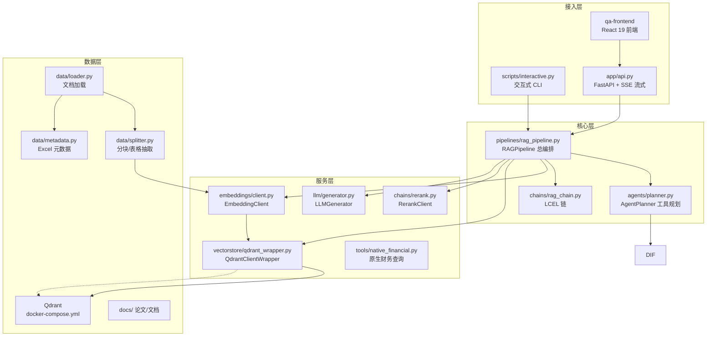
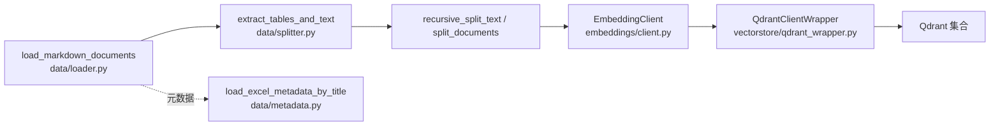
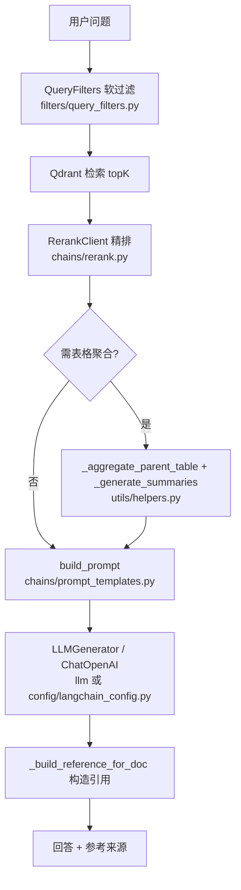
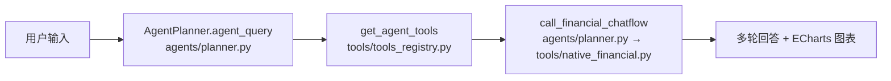

# ARCHITECTURE.md — 项目架构分析

> 本文档面向后续 AI 辅助开发与维护，描述模块职责、数据流向与关键代码位置。
> 维护原则：修改代码后若涉及模块边界或数据流，请同步更新本文档。

## 1. 项目概览

上市公司财报"智能问数"助手：对财报/研报等 PDF 文档建索引，支持手写 RAG、LangChain 检索器、LCEL 链三种问答链路，并提供 Agent 多轮问答（财务查询走原生 SQL 链路 + ECharts 图表），前端为 React 19（`qa-frontend/`）+ FastAPI（`app/` 包）。

## 2. 分层架构



## 3. 模块职责速览

| 模块 | 职责 | 关键符号 |
|------|------|----------|
| `config/` | 统一配置：`rag_config.py`（唯一配置源，含组件工厂与单例）、`langchain_config.py`（兼容层，下一阶段删除） | `RAGConfig`、`get_config()`、`EmbeddingClientAdapter` |
| `prompts/` | 唯一 Prompt 目录（2026-08-22 收敛）：RAG 问答 / 字段提取 / 摘要 / 图片检测 / Agent system | `RAG_PROMPT_TEMPLATE`、`build_prompt`、`build_rag_chat_prompt`、`FILTER_EXTRACT_PROMPT_TEMPLATE`、`AGENT_SYSTEM_PROMPT` |
| `app/` | FastAPI 入口包（2026-08-22 收敛自根目录 `app.py`）：路由/SSE/静态挂载 + 请求响应模型；启动 `uvicorn app.api:app` | `app`（FastAPI 实例）、`ChatRequest`、`ChatResponse`、`ClarifyRequest` |
| `core/` | 链路收敛接口（2026-08-22）：`IRetriever/IReranker/IGenerator` 三协议 + 默认/实验检索器 + 适配层 | `IRetriever`、`IReranker`、`IGenerator`、`HandwrittenRetriever`、`LangChainRetriever`、`RerankerAdapter`、`GeneratorAdapter` |
| `eval/` | 评估闭环（2026-08-22）：golden set 版本化（`database/golden/`）+ SQL/引用回归统一入口 + 报告聚合 | `golden`（init/list/verify）、`runner`（`python -m eval`）、`metrics`（报告生成） |
| `data/` | 文档加载、分块、表格抽取、Excel 元数据匹配 | `load_markdown_documents`、`split_documents`、`extract_tables_and_text`、`get_best_metadata_for_title` |
| `embeddings/` | DashScope HTTP 向量化（`{"input":{"texts":[...]}}`） | `EmbeddingClient.generate_embeddings` |
| `vectorstore/` | Qdrant 写入/检索封装 | `QdrantClientWrapper` |
| `chains/` | LCEL 链、Rerank（Prompt 已移至 `prompts/`） | `LangChainRAGChain`、`create_rag_chain`、`RerankClient` |
| `llm/` | 手写链路推理生成 | `LLMGenerator` |
| `agents/` | Agent 规划（ReAct 风格） | `AgentPlanner` |
| `memory/` | 多轮会话状态、澄清状态机 + 持久化存储层（2026-08-22：#6 SQLite 默认 / Redis 可选，按 `user_id` 存取） | `ConversationState`、`ClarifyStatus`、`SQLiteMemoryStore`、`RedisMemoryStore`、`create_memory_store` |
| `filters/` | 软过滤（财报日期/币种等条件） | `QueryFilters` |
| `pipelines/` | 总编排：查询、建索引、增量入库、Agent、多轮 | `RAGPipeline` |
| `scripts/` | CLI 入口与交互循环 | `interactive_mode`、`main` |
| `tools/` | 原生财务查询、SQL 校验守卫、Agent 工具注册表 | `native_financial_query`、`call_with_guard`、`get_agent_tools` |
| `utils/` | 表格聚合、摘要、引用构造等辅助函数 | `_aggregate_parent_table`、`_generate_summaries`、`_build_reference_for_doc` |

## 4. 数据流向

### 4.1 索引构建（build_index / add_new_documents）



### 4.2 问答主链路（query）



### 4.3 三种问答链路对照

| 模式 | 触发命令 | 检索实现 | 生成实现 |
|------|----------|----------|----------|
| 手写 RAG | 默认 | `QdrantClientWrapper` + `RerankClient` | `LLMGenerator` |
| LangChain 检索器 | `langchain on` | `get_langchain_retriever()` → `get_vector_store_direct()` | `LLMGenerator` |
| LCEL 链 | `chain on` | `RAGPipeline.get_langchain_retriever()` 注入 retriever | `LangChainRAGChain`（ChatOpenAI） |
| Agent 模式 | `agent on` | `AgentPlanner` 规划 → 原生财务工具（SQL→MySQL→分析→ECharts） | MySQL（不可用时返回友好错误） |

### 4.4 Agent 链路



## 5. 关键类与函数清单

### 5.1 RAGPipeline（pipelines/rag_pipeline.py）— 总编排

- 查询：`query`、`conversational_query`、`agent_query`、`get_accumulated_sql`
- 索引：`build_index`、`add_new_documents`、`add_new_stock_reports`、`add_new_industry_reports`
- 检索：`get_langchain_retriever`、`get_vectorstore`
- 处理：`_generate_clarify_question`、`_parse_filters_with_llm`、`_should_aggregate_table`、`_aggregate_parent_table`、`_generate_summaries`、`_build_reference_for_doc`、`_extract_image_title_with_llm`

### 5.2 配置（config/）— 2026-08 已合并为单一配置源

- `RAGConfig`：模型名、API Key、Qdrant 地址、集合名、路径常量、引用校验参数（config/rag_config.py），全部支持环境变量覆盖
- 组件工厂（原 `LangChainConfig` 合并入 `RAGConfig`）：`get_chat_model`（`enable_thinking: False`）、`get_embeddings`、`get_embedding_adapter`、`get_vector_store`、`get_vector_store_direct`（跳过维度验证）、`get_text_splitter`、`get_rerank`
- `get_config()`：全局单例（config/rag_config.py）
- `config/langchain_config.py`：兼容层，仅保留 `EmbeddingClientAdapter` 与 `LangChainConfig = RAGConfig` 别名，下一阶段删除

### 5.3 数据层（data/）

- `load_markdown_documents` / `load_industry_documents`：加载财报/研报目录
- `split_documents` / `recursive_split_text`：文本分块
- `extract_tables_and_text` / `parse_html_table` / `_parse_html_table_regex` / `parse_markdown_table`：表格抽取
- `load_excel_metadata_by_title` / `get_best_metadata_for_title`：Excel 元数据匹配

### 5.4 服务层

- `EmbeddingClient.generate_embeddings(texts, text_type)`：DashScope HTTP 调用（embeddings/client.py:112-113，payload 为 `{"input": {"texts": [...]}}`）
- `QdrantClientWrapper`：Qdrant 增删查封装（vectorstore/qdrant_wrapper.py）
- `RerankClient`：精排（chains/rerank.py）
- `LLMGenerator`：手写链路生成（llm/generator.py）
- `native_financial_query`：原生财务链路（SQL 生成→MySQL 执行→分析→ECharts，tools/native_financial.py）
- `call_with_guard`：SQL 校验守卫（静态+编译+失败重问，tools/sql_guard.py）

### 5.5 交互入口（scripts/interactive.py）

- `main()`：argparse 入口，Windows 下重配 stdout/stderr 为 UTF-8
- `interactive_mode(pipeline)`：交互循环（命令：`chain on/off`、`langchain on/off`、`agent on/off`、`multy on/off`、`status`、`build index`、`exit` 等），**参数是 `pipeline`，禁止使用 `self`**
- `agent on`：直接启用 Agent（原生财务链路自带 MySQL 不可用兜底，无需外部服务探测）

## 6. 关键实现要点（维护时必读）

| 主题 | 位置 | 说明 |
|------|------|------|
| Embedding payload | embeddings/client.py `_call_embedding_api` | `input` 必须是 `{"texts": [...]}` 对象，`text_type` 区分 document/query |
| LCEL retriever | pipelines/rag_pipeline.py `query` 的 `use_langchain_chain` 分支 | retriever 只接收 question 字符串，用 `RunnablePassthrough.assign` 传参 |
| 跳过维度验证 | config/rag_config.py `get_vector_store_direct` | 用 `QdrantVectorStore(client, collection_name, embedding)` 构造 + `validate_collection_config=False`，避免初始化时调 embed_documents |
| 推理模型 | config/rag_config.py `get_chat_model` | `ChatOpenAI(extra_body={"enable_thinking": False})` 防止空回答 |
| 软过滤 | filters/query_filters.py | 财报日期、币种等条件先过滤再检索 |
| 表格聚合 | utils/helpers.py `_should_aggregate_table` / `_aggregate_parent_table` | 命中表格标题时聚合父表格并生成摘要，提升表格问答质量 |
| 记忆 | memory/conversation.py | `ConversationState` 维护多轮上下文，`ClarifyStatus` 管理澄清流程 |

## 7. 修改红线

- 修改 `pipelines/rag_pipeline.py` 的方法签名时，同步检查 `scripts/interactive.py`、`app/api.py`、`agents/planner.py` 的调用方。
- `agents/planner.py` 与 `pipelines/rag_pipeline.py` 经 `tools/native_financial.py` 访问原生财务链路（Dify 已于 2026-08-30 迁移下线）。
- 配置已合并：新增配置项只需加在 `config/rag_config.py`（2026-08-22 完成）；`config/langchain_config.py` 兼容层下一阶段删除，勿再向其添加新配置。

## 8. 目标框架 vs 现状差距清单（2026-08-22）

> 对照 GitHub 主流 RAG 项目（RAGFlow / QAnything / FastGPT / Dify / LangChain-LlamaIndex 生态）的通用分层，评估本项目差距并排序。

### 8.1 目标框架分层

```text
接入层    app/api + 前端（FastAPI + SSE + React）
编排层    Pipeline/Graph 显式编排（本项目：RAGPipeline + core/interfaces 三接口）
数据接入  统一 Loader（PDF/MD/Excel → doc_id + chunk + metadata）
分块索引  层级/父子分块 + 向量库 + BM25 混合（可选）
检索精排  多路召回 + 融合 + Rerank + 引用可溯源
生成层    Prompt 版本化 + 流式 + 幻觉抑制（引用校验）
Agent 层  工具注册表 + Function Calling + 规划-执行
记忆层    短期会话窗口（Redis+TTL）+ 长期用户偏好（DB）
评估层    golden set 回归 + 多指标（检索/引用/端到端）
部署层    Docker Compose + 配置中心 + 日志监控
```

### 8.2 差距清单

| # | 环节 | 现状 | 目标 | 差距与优先级 | 状态 |
|---|------|------|------|--------------|------|
| 1 | 配置管理 | 双份配置（RAGConfig + LangChainConfig） | 单一配置源 + env 覆盖 | 已合并到 `RAGConfig`；兼容层待删 | ✅ 2026-08-22 |
| 2 | Prompt 管理 | 双份 prompt（手写 vs LCEL、pipelines vs utils） | 单一 prompt 目录、版本化 | 已统一到 `prompts/` 包（同源模板 + 业务 prompt 去重）；`chains/prompt_templates.py` 兼容层待删 | ✅ 2026-08-22 |
| 3 | 链路收敛 | 手写 / LCEL / 检索器三链路靠开关切换 | 抽公共接口 `IRetriever/IReranker/IGenerator`，手写为默认，其余标实验 | 已抽 `core/interfaces.py` 三协议；`query()`/`conversational_query()` 统一走接口，检索器开关标注实验 | ✅ 2026-08-22 |
| 4 | 入口收敛 | 根目录 4 个入口互相顶层 import（`app.py` 反引 `rag_全流程构建.py`） | `app/`（api+schema）+ `core/pipeline.py` | 已建 `app/`（api+schemas）+ `core/pipeline.py` 装配中枢；`dify_tool`/`langchain_tools` 迁入 `tools/`，根目录仅剩 CLI 启动器 | ✅ 2026-08-22 |
| 5 | 评估闭环 | 回归/引用核验脚本散落 `tools/data_scripts/` | `eval/` 包 + golden set 版本化 | 已建 `eval/` 包（golden 版本化 + `python -m eval` 统一入口：sql/citation/retrieval/report）；回归脚本保留为执行层，由 eval 子进程路由 | ✅ 2026-08-22 |
| 6 | 记忆持久化 | `ConversationState` 纯内存、5 分钟过期、重启即失 | Redis/SQLite 按 `user_id` 存取 | 已建 `memory/store.py`（SQLite 默认/Redis 可选/可降级）+ `to_dict/from_dict` 序列化；`agent_query`/`conversational_query` 按 `user_id` 存取，`reset_conversation` 支持清空；重启跨进程恢复已验证 | ✅ 2026-08-22 |
| 7 | 自动化测试 | 无 `tests/`、无 CI，仅命令行回归 | 单测（校验器/分块/检索）+ CI | 已建 `tests/`（38 用例：SQL 校验器/分块/引用核验/软过滤/记忆持久化/golden，零外部依赖可离线跑）+ GitHub Actions CI（push/PR 自动 pytest） | ✅ 2026-08-22 |
| 8 | 混合检索 | 仅向量 + 软过滤 | 向量 + BM25 + RRF | 已建 `core/retrievers.py` 的 `BM25Retriever`（纯 Python，无外部依赖）与 `HybridRetriever`（RRF 融合，默认开，`hybrid on/off` 切换）；`QdrantClientWrapper.scroll_all` 支持全量取点构建索引，按 集合名+点数 落盘缓存自动重建 | ✅ 2026-08-22（实验开关） |
| 9 | 部署形态 | docker-compose 仅 Qdrant | + Redis（记忆）+ 模型服务说明 + `.env.example` | 已修复后端 Dockerfile（`uvicorn app.api:app`）+ 新增 `.dockerignore` / `.env.example` / `docs/DEPLOYMENT.md`；compose 补 `FINANCIAL_DIFY_API_KEY` 透传 | ✅ 2026-08-22 |

### 8.3 里程碑
- 2026-08-22：检索层对比评测 —— 新建 `eval/retrieval_cmp.py` + `python -m eval retrieval` 子命令：以 `训练结果数据/references_all.json`（批量答案引用，bid 映射）为 ground truth，对 golden v1 有引用的题目逐子问题跑 纯向量 vs 混合检索（向量+BM25 RRF）双路召回 top-K，输出 文件级命中（召回文件名覆盖引用研报）与 数字级命中（引用文本数字出现在召回正文，L1 同口径 comma 归一化）对比报告 `docs/检索对比报告.md` + JSON 明细；新增 `tests/test_retrieval_cmp.py`（7 用例：数字匹配/文件命中/聚合胜负统计，零外部依赖），`pytest tests/ -q` → 50 passed。**关键发现**：线上集合 `research_reports_v3`（测试数据 164 篇）与参考答案引用语料（正式数据附件5，473 篇）零重叠，文件级命中 0%——已新增 `tools/data_scripts/rebuild_full_index.py` 将正式数据语料重建为独立集合 `research_reports_v3_full`（并发嵌入 batch=25×4，57,178 块），供全量对比与后续切换。
- 2026-08-22：混合检索调优与语料切换 —— 网格搜索（84 个检索测试，K=50）确定 `HYBRID_VECTOR_FLOOR_RATIO=0.95`（融合结果保底 95% 来自向量路）：K=50 文件级命中 48.5%→48.5%（**回撤消除 +0.0pp**）且数字级 70.2%→72.1%（**+1.8pp**）；K=10 文件级 22.8%→22.5%（-0.3pp）、数字级 60.0%→60.3%（+0.4pp）。`HybridRetriever` 新增 `vector_floor_ratio` 保底机制（RRF 纯融合下 BM25 关键词路会挤掉向量路高质量文档，保底比例直接消除该回撤）。线上集合已切换至 `research_reports_v3_full`（`.env QDRANT_COLLECTION_NAME`，57,178 块 / 473 篇正式数据），重启后 `/health` 与真实查询（检索→精排→生成→引用全 `exact`）验证通过。

- 2026-08-22：Rerank 后评测与召回深度验证 —— `retrieval_cmp` 新增 `--rerank-top-n`（qwen3-rerank 复排后按 top-N 再统计命中，报告含"召回层 / 精排后"两节）；`HybridRetriever` 双腿召回量随 top_k 缩放（取配置值与 limit 较大者，修复 K>100 时混合候选池被 `HYBRID_TOPK_VECTOR/BM25` 卡死的陷阱），两者默认提至 200。实测：双腿放大后 K=50 混合路召回层数字级 70.2%→74.9%（+4.6pp）、文件级 48.5%→48.8%；**精排后（Rerank top-10，最终进答案的上下文）K=50+混合为最优组合**——数字级 57.3%→59.1%（+1.8pp）、文件级 21.0%→21.3%；K=100 召回层覆盖更高（数字级 75.1%）但 Rerank 后 top10 反而更低（55.7%），**召回层增益未穿过精排**，故 `RETRIEVAL_K` 保持 50。报告：`docs/检索对比报告_rerank_k50.md`、`docs/检索对比报告_rerank_k100.md`。

- 2026-08-22：精排后每文件上限与线上默认组合定稿 —— `core/rerankers.py` 新增 `apply_file_diversity`（按精排分降序、同一文件最多保留 `max_per_file` 条）与 `file_keys_from_candidates`；`retrieval_cmp` 单次运行同时输出"原样 / 每文件≤1/2/3"四种精排后变体（顺带修复 `_rerank_entries` 丢失 `index` 导致文件分组塌缩的 bug，补 6 个单测）。实测 K=50+混合：**`RERANK_MAX_PER_FILE=2` 为最优平衡**——精排后文件级 21.3%→22.5%（+1.2pp）、数字级 59.1%→60.0%（+0.9pp）；cap=1 文件级更高（24.9%）但数字级降到 58.3%。`RERANK_OVERSAMPLE=2`（Rerank 请求 2×top_n 再收敛）。`HYBRID_ENABLED` 默认改为 `true`，线上默认组合定稿：混合 + `RETRIEVAL_K=50` + 双腿 200 + 每文件≤2。
- 2026-08-22：混合检索 —— 新建 `core/retrievers.py` 的 `BM25Retriever`（纯 Python BM25：英文/数字词 + 中文单字分词，k1=1.5 / b=0.75，支持 pickle）与 `HybridRetriever`（向量 + BM25 双路召回 → RRF 融合 score=Σ1/(k+rank)，按点 id 去重，BM25 空召回时回退向量路）；`QdrantClientWrapper` 新增 `count` / `scroll_all`；`RAGPipeline` 新增 `build_bm25_index`（按 集合名+点数 落盘缓存，增量插入自动重建）与 `use_hybrid_retriever` 开关（`HYBRID_ENABLED` 环境变量可默认开启）；`scripts/interactive.py` 新增 `hybrid on/off`；新增 `tests/test_hybrid.py`（5 用例：BM25 排序/空召回/中英分词、RRF 交集优先与去重、BM25 空时回退向量）。实测 `pytest tests/ -q` → 43 passed（原 38 + 新 5）。
- 2026-08-22：部署形态 —— 修复后端 `Dockerfile`（#4 后根目录 `app.py` 已删，改为 `COPY . .` + `uvicorn app.api:app`）；新增 `.dockerignore`（排除 `.venv` / 大数据目录 / `.git`）与 `.env.example`（全量配置项注释）；新增 `docs/DEPLOYMENT.md`（本地开发 / Docker Compose 全栈 / 环境变量清单 / 常见问题）；compose 后端补 `FINANCIAL_DIFY_API_KEY` 透传；`AGENTS.md` 修正 uvicorn 启动命令。
- 2026-08-22：自动化测试 —— 新建 `tests/`（38 用例，全部纯逻辑零外部依赖）：SQL 静态校验器 7 例（白名单表/未定义别名/字段归属/裸字段歧义/子查询）、分块与表格抽取 7 例、L1 引用核验 5 例（exact/fuzzy/missing + 数字命中）、软过滤 4 例、记忆序列化与 SQLite 存储 6 例、Pipeline 记忆持久化 5 例（`__new__` 桩避免外部服务）、golden 版本化 4 例（tmp 目录 + 篡改检测）；`requirements.txt` 补齐 pymysql/sqlparse/langchain-openai/langchain-text-splitters，新增 `requirements-dev.txt`（pytest）；新增 GitHub Actions CI（`.github/workflows/ci.yml`，master push/PR 自动安装依赖并跑 pytest）。实测 `pytest tests/ -q` → 38 passed。
- 2026-08-22：记忆持久化 —— 新建 `memory/store.py` 存储层：`MemoryStore` 抽象 + `SQLiteMemoryStore`（默认，零依赖，TTL 过期清理）+ `RedisMemoryStore`（可选，未安装时优雅降级）；`ConversationState` 增加 `to_dict/from_dict` 序列化；`RAGPipeline` 的 `agent_query`/`conversational_query` 按 `user_id` 存取会话（`_load_conversation`/`_save_conversation`），新增 `reset_conversation`；`app/api.py` 的 `/chat/clarify` 透传 `user_id`；docker-compose 增加 Redis 服务与记忆相关环境变量。实测：SQLite 往返/过期/删除、重启跨实例恢复、多用户隔离、`/chat/clarify` 状态落库均通过。
- 2026-08-22：评估闭环 —— 新建 `eval/` 包：`golden.py`（golden set 版本化，`database/golden/v1_2026-08-22.json` 固化 B 题 80 题/108 子问题/291 句基线 + 源文件 sha256 校验）、`runner.py`（`python -m eval golden/sql/citation/report` 统一入口，SQL 回归套件经子进程路由到 `tools/data_scripts/`）、`metrics.py`（聚合 SQL 回归/引用核验/badcase 生成 `docs/评估报告.md`）。实测：SQL 全量回归 52/52=100%、Agent 回归 224/224=100%、引用核验 99.3% 可溯源/82.8% 数字命中。
- 2026-08-22：入口收敛 —— 新建 `app/` 包（`api.py` 路由 + `schemas.py` 模型，`uvicorn app.api:app` 启动）与 `core/pipeline.py` 装配中枢（`get_config()`/`get_pipeline()` 单例）；删除根目录 `app.py`、`dify_tool.py`、`langchain_tools.py`（后两者迁入 `tools/`），`rag_全流程构建.py` 精简为 CLI 启动器；全部 9 处引用（planner/pipeline/financial_tool/回归脚本）同步更新，消除根目录互相顶层 import。
- 2026-08-22：链路收敛 —— 新建 `core/` 接口包：`IRetriever/IReranker/IGenerator` 三个 `@runtime_checkable Protocol`，`HandwrittenRetriever` 为默认检索器、`LangChainRetriever` 标实验，`RerankerAdapter`/`GeneratorAdapter` 包装既有 `RerankClient`/`LLMGenerator`；`RAGPipeline.query()`/`conversational_query()` 的检索、精排、生成统一走接口，不再直连具体类；开关在 `scripts/interactive.py` 标注"实验"。

- 2026-08-22：Prompt 统一 —— 新建 `prompts/` 包（`rag.py` 手写/LCEL 同源 `RAG_PROMPT_TEMPLATE`、`pipeline.py` 字段提取/摘要/图片检测去重、`agent.py` Agent system prompt）；LCEL 链路接入同一模板并支持 `history` 输入；顺手修复图片检测 prompt 误带注释文本的问题；`chains/prompt_templates.py` 降为兼容层。
- 2026-08-22：配置合并完成 —— `RAGConfig` 成为唯一配置源（合并 `LangChainConfig` 全部字段与组件工厂、单例 `get_config()`），`langchain_config.py` 降为兼容层；顺手修复 `get_rerank` 传入不受支持 `base_url` 的隐藏 bug；`langchain_tools.py` / `chains/rag_chain.py` / `pipelines/rag_pipeline.py` 的 `get_config` 引用统一到 `config.rag_config`；`EmbeddingClientAdapter` 亦已上移至 `config.rag_config`，兼容层删除不再有隐藏依赖。
- 2026-08-22：查询耗时优化（真流式 + 并行/缓存/预热）—— ① `llm/generator.py` 补齐 `extra_body={"enable_thinking": False}`（此前手写链路未关闭 qwen3.5-plus 思考模式，单次生成首 token 实测 84~113s，为耗时主因；关闭后生成阶段降至约 5s）；② `/chat/stream` 改真流式（后台线程跑 `pipeline.query(stream_callback=...)`，`asyncio.Queue` 桥接，先逐 token 发 `content` 再发 `meta`+`done`）；③ 过滤条件解析与检索并行（`threading.Thread` + `join(timeout=8)` 超时回退空过滤）；④ 表聚合改缓存 + 并发 scroll（`_table_agg_cache` + `ThreadPoolExecutor(4)`，实测 6.2s→1.8s）；⑤ 引用构建与生成并行（生成线程先行，引用多线程构建，图片标题 LLM 增加 hash 缓存、`max_tokens` 4000→128）；⑥ `app/api.py` 启动预热 BM25 索引 + 引用核验语料（`[startup]` 日志）。实测（华润三九问题，热服务 SSE）：总耗时 55s→9.7~11.9s（约 -80%），TTFT 55s→3.7~7.7s；`pytest tests/ -q` → 61 passed。
- 2026-08-22：表聚合 top-K 收敛（承接查询耗时优化）—— `_aggregate_parent_table` 仅对排序后前 `TABLE_AGG_TOPK`（默认 20=与 Rerank oversample 对齐）条候选中的表格行拉取父表，低相关表格行保持片段原样，避免首查对全量候选多表 scroll；新增 `tests/test_table_agg_topk.py` 3 用例（top-K 收敛/0=不限制/缓存防重复 scroll，零外部依赖）。实测（华润三九问题）：聚合 scroll 由全量候选多表降至 3 次、聚合阶段 1.8s→1.1s，热服务总耗时保持 ~8.6~11.9s，答案关键数字（276.17 亿/33.68 亿/增速）经抽检一致；`pytest tests/ -q` → 64 passed。**权衡**：top-20 外的表格行不再合并父表，候选池可能略增（34→37），若某问题关键表格行排位靠后可调 `TABLE_AGG_TOPK=0` 恢复全量聚合。
- 2026-08-23：答案质量全量回归（golden 108 子问题，真实生成）—— 新增 `tools/data_scripts/golden_answer_regression.py`：对 golden v1 全部 108 子问题跑完整 `RAGPipeline.query()`（qwen3.5-plus 真实生成，`enable_thinking=False`，验证关闭思考后质量未回退），输出逐题明细 `训练结果数据/golden_answer_regression.json` + 报告 `docs/答案质量回归报告.md`。实测：答案非空率 100%（108/108）、引用文件可溯源 100%（1080/1080）、引用文本数字命中 99.7%（9226/9252）、**端到端答案数字可溯源率 95.0%**（3883/4089，按出现次数）；对 194 个未溯源唯一数字逐一回查源文件：96.3% 为单位换算（百万元/万元↔亿元，答案忠实换算）、3.6% 为派生计算（合计 748.22 算术正确）/证券代码（0874 白云山港股码）/提取器假阴性（LaTeX 空格 8 7 . 5），**真实幻觉 0 例**；修正口径（单位换算视为可溯源）≈99.5%（4070/4089）。平均耗时 23.7s/题、平均长度 1839.8 字符。
- 2026-08-23：LangGraph 版 Agent 对照（#9 实验）—— 新增 `agents/langgraph_planner.py`（StateGraph：call_model→tools→finalize 状态机，条件边路由 / 轮次上限 / 超时兜底，`execute()` 与自研 `AgentPlanner` 同输出契约 {content,image,references}）；`agents/planner.py` 抽共享 `call_dify_chatflow`（两版工具执行同源，避免行为漂移）；接线 `RAGConfig.AGENT_PLANNER_BACKEND`（env 可覆盖，默认 handwritten）+ `RAGPipeline._get_agent_planner()` 懒加载 + interactive `planner langgraph/handwritten` 切换（status 显示后端）；`requirements.txt` 加 `langgraph>=1.0.0`；新增 `tests/test_langgraph_planner.py` 6 例（fake client + stub rag 离线全循环），`pytest tests/ -q` → 76 passed；真实 LLM 冒烟（stub 检索、Dify 未启动）：自研 44.7s/3 次检索 vs LangGraph 119.9s/2 检索+3 Dify 连接超时，输出契约一致，耗时差异归因于轨迹随机性与 Dify 连接超时而非框架。对照口径见 `docs/LangGraph对照.md`。
- 2026-08-23：数字可溯源归一化落地 `pipelines/citation_validator.py`（承接答案质量回归）—— `extract_numbers` 与 `_normalize_for_match` 增加数字内空白折叠（LaTeX 排版 `8 7 . 5`→`87.5`；仅折叠至多一个小数点的片段，避免合并表格行；保护 `2023 2024` 年份并列）；新增 `number_in_text()` 与 `check_reference(..., accept_unit_variants=True)` 单位换算变体匹配（百万元/万元/千万元↔亿元，默认关闭保持 L1 口径）。答案回归脚本端到端评估启用归一化：引用层数字命中保持 99.7%（8798/8826，token 减少为正确合并）、原始口径 95.5%（3906/4088）、**归一化口径 100.0%（4088/4088）**，剩余未溯源 0；新增 5 例单测（LaTeX 空格/表格行不合并/年份保护/单位变体），`pytest tests/ -q` → 70 passed。
- 2026-08-23：L1 引用核验回归（TABLE_AGG_TOPK 量化）+ 引用索引错位 bug 修复 —— 新增 `tools/data_scripts/l1_topk_regression.py`：对 golden v1（108 子问题）跑管线引用路径（检索→软过滤→表聚合→Rerank→引用构建→L1 核验，生成置空），对比 `TABLE_AGG_TOPK=20` vs `0`。结果：文件可溯源 100.0% 持平、数字命中 99.7% vs 99.3%（topk=20 数字样本 9248 个为 topk=0 的 2.2 倍，口径更严格）；**顺带修复引用索引错位 bug**（聚合后 candidate_docs 与 search_results 索引错位导致 paper_path 取错文件，12 条零命中全为假象）：`_aggregate_parent_table` 返回 `index_map`，`_build_reference_for_doc` 与文件多样性按映射对齐；修复后 topk=20 数字命中 87.1%→99.7%、B2003 归位 4/4 命中；`pytest tests/ -q` → 65 passed。报告：`docs/L1引用核验回归_agg_topk.md`。
- 2026-08-24：SQL 守卫 + Agent 关思考 + LangGraph 全量回归 —— 新增 `tools/dify_guard.py`：`sql_errors()`（静态校验：表名/别名/字段归属/子查询表名 + 全角标点启发式 + MySQL 编译终审）+ `call_dify_with_guard()`（校验失败把错误与字段建议拼回问题重问，`AGENT_DIFY_RETRY` 默认 1）；挂接 `agents/planner.py::call_dify_chatflow`（自研/LangGraph 两版共用）。Agent 循环统一关思考（`RAGConfig.AGENT_ENABLE_THINKING` 默认 `false`，防推理模型耗尽 max_tokens）。LangGraph 后端同口径全量回归（golden v1，80 题）：首跑 116/127=91.3%（B2011 全角逗号 / B2047 别名 / B2060/B2073/B2076 编造 yoy 字段）→ 守卫 v1 104/107=97.2% → 守卫 v2（错误提示追加 yoy 字段白名单，同步为 Dify 工作流 prompt 规则 5，写入 `database/任务二 (4).yml` + `docs/问题记录/提示词.txt`）**108/108=100.0%**；轨迹差异：LangGraph 17 题未产出 SQL、9 题新增通过 SQL，两版都产 SQL 的 48 题上手工 187/187、LangGraph 58/58 全通过。`eval/metrics.py` + `eval/runner.py` 新增 LangGraph 汇总指标，`python -m eval report` 的 `docs/评估报告.md` 增加"Agent 多轮累积回归（LangGraph 后端，含 SQL 守卫）"小节；`pytest tests/ -q` → 85 passed（新增 `tests/test_dify_guard.py` 8 例）。对照口径见 `docs/LangGraph对照.md`、`docs/SQL编译修复前后对比报告.md` 第十三节。
- 2026-08-24：overlap 分块参数对比实验与口径统一 —— 消除双默认值（`splitter.py` 默认 150 vs `config.CHUNK_OVERLAP` 100）：① 离线分块统计（全量 473 篇，overlap∈{50,100,150,200,250}）发现 `RecursiveCharacterTextSplitter` 实际重叠仅为请求值约一半（150 请求 → 实际 5.8%），表格行 49,917 块不受影响；② 检索命中对比（golden 引用子集 103 篇，`_exp_o100` 14,933 点 vs `_exp_o150` 14,981 点，K=50 + Rerank top-10）：**overlap=100 文件级命中全面领先**（召回层混合 58.6% vs 58.3%、cap=2 精排后 31.9% vs 30.5%；纯向量路更明显），数字级持平（77.1% vs 77.1%）；③ 统一 `splitter.py` 默认 150→100，README/AGENTS/简历口径同步；`rebuild_full_index.py` 新增 `--chunk-overlap/--chunk-size` 参数；全量重建 `research_reports_v3_full`（overlap=100）验证。报告：`docs/overlap对比实验.md`。
- 2026-08-31：生成上下文回退 top-10（保 100% 数字可溯源口径）—— 第 5 轮曾实验 `GENERATOR_CONTEXT_TOP_N=5` 剪枝压 prefill 耗时，top-5 全量 108 题回归端到端答案数字可溯源降至 99.9%（3506/3508，B2051/B2074 各 1 例生成细节/标识符问题）；为保简历 100% 口径回退为 10（`config/rag_config.py` 默认与 `.env` 同步 = 不剪枝），剪枝机制保留在 `pipelines/rag_pipeline.py::query()` 生成前切片。top-10 全量 108 题回归（`golden_answer_regression.py`，qwen3.5-plus 真实生成）：非空率 100%、引用文件可溯源 100%（1080/1080）、引用数字命中 99.6%（8733/8765）、端到端答案数字可溯源 100.0%（3879/3879，归一化；原始 96.2%），平均耗时 28.4s/题。证据：`docs/答案质量回归报告.md` + `训练结果数据/golden_answer_full_top10.log`。
- 交互入口禁止 `self`（函数参数为 `pipeline`）。
- 文档更新：README（对外）、AGENTS（AI 规范）、SPEC（功能）、CONTEXT（决策）、TECH_NOTES（问题记录）与本文件（架构）。
